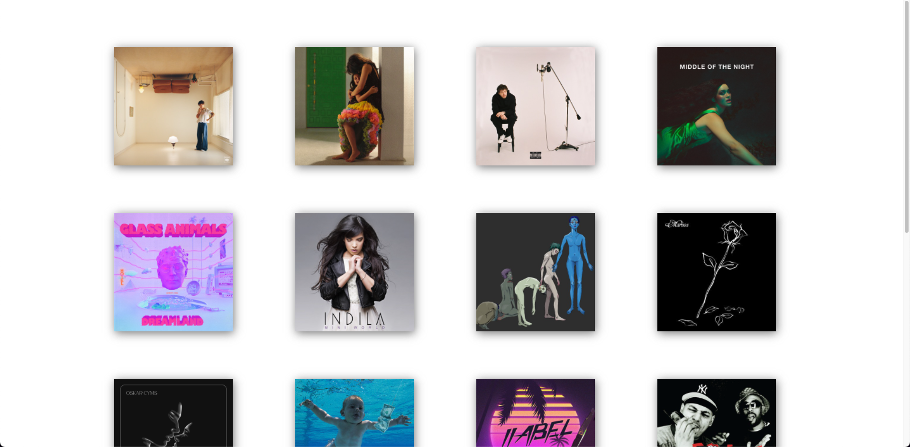

# Record Collection

## Table of contents

- [Record Collection](#frontend-mentor---nft-preview-card-component-solution)
  - [Table of contents](#table-of-contents)
  - [Overview](#overview)
    - [The challenge](#the-challenge)
    - [Screenshot](#screenshot)
    - [Links](#links)
  - [My process](#my-process)
    - [Built with](#built-with)
  - [Author](#author)

## Overview

### The challenge

Users should be able to:

- View the optimal layout for the app depending on their device's screen size
- See hover states for all interactive elements on the page
- Click one of the record to play/pause the music
- Go to song link on Apple Music

### Screenshot

### Links

- [Live Site URL](https://record-collection.vercel.app/)

## My process

### Built with

- Flexbox
- [React](https://reactjs.org/) - JS library
- [axios](https://github.com/axios/axios) - HTTP Client
- [Styled Components](https://styled-components.com/) - For styles

## Author

- Website - [Safa Elmali](https://safaelmali.com/)
- Frontend Mentor - [@SafaElmali](https://www.frontendmentor.io/profile/SafaElmali)
- Twitter - [@SafaElmali](https://twitter.com/SafaElmali)
- Github - [@SafaElmali](https://github.com/SafaElmali)
